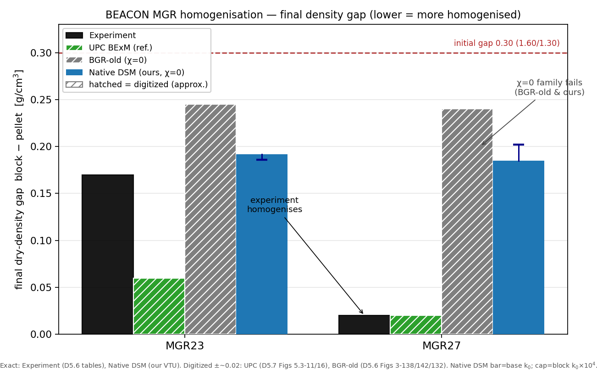
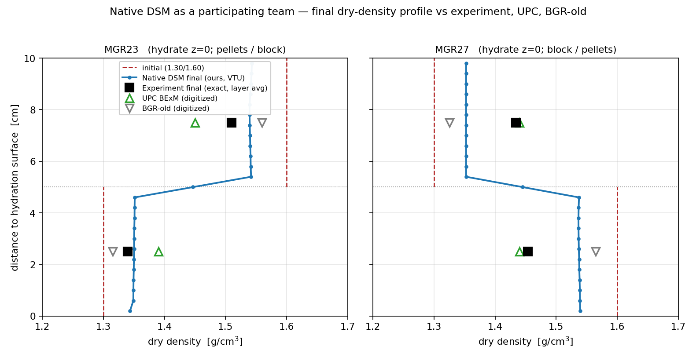

# MGR pellet/block homogenisation with the native DSM — calibration, blind prediction, and where it sits among the BEACON teams

> **HISTORICAL / SUPERSEDED (2026-06-01).** This markdown was the working analysis note. The
> **canonical, finished deliverable** is the modelling report + beamer pushed to the EBS Task-13 git:
> `ogs-models/EBS/Task13/2026_06_01_MGR_FEBEX_pellet_block_homogenisation/deliverables/`
> (`MGR_FEBEX_homogenisation_report.{tex,pdf}`, `MGR_FEBEX_homogenisation_beamer.{tex,pdf}`;
> `github.com/VinayGK/EBS`, commit 89b8ab5). The "pending elastic-parameter choice" caveats below were
> **resolved**: the mechanical parameterisation was corrected to a FEBEX-sourced Modified Cam-Clay set
> (ENRESA 2000 Cc/Cs + φ; UPC Po*), and the collapse test was found **integrator-blocked** (9 MCC
> configurations wall at the swelling-stress onset). The LE two-blocker result below stands. Kept for
> the working-history record (do not delete; §6/§7 .md-retention).*

*BGR — native Pi-path double-structure model (DSM), OpenGeoSys-6. Drafted 2026-06-01. Internal analysis report; numbers are either EXACT (tabulated in the deliverable, or read from our own VTU) or DIGITIZED-approximate from published figures — every figure call-out below carries its source.*

---

## 1. The question, and the axes it has to be kept on

The MGR family asks one thing: take a column that is half loose FEBEX pellets (ρ_d ≈ 1.30) and half compacted block (ρ_d ≈ 1.60), hydrate it at constant total volume, and ask whether the two dry densities **homogenise**. The experiment answers yes — and MGR27, the *blind, geometry-inverted* case, homogenises almost completely (final gap 0.02 g/cm³, against an initial 0.30).

Two distinct exercises must not be blurred:

- **Calibration (MGR23):** does a permeability calibration *exist* that brings the native DSM onto the measured homogenisation?
- **Prediction (MGR27):** freeze that calibration, invert the geometry, and see whether the density and stress targets are met **without re-fitting**. This is the only leg that can *validate* anything; the calibration leg, on its own, can only *fit*.

And the running discipline of the whole report: **calibrated ≠ identified ≠ validated**, **transient ≠ steady state**, **delivery (hydraulic) ≠ destructuring (mechanical)**, **predicted ≠ verified**.

---

## 2. The native DSM as a participating team — the framework table

| | constitutive frame | HM coupling (Bishop χ) | macro water-retention | micro↔macro coupling | homogenisation result |
|---|---|---|---|---|---|
| **Experiment** | — | — | — | — | **homogenises** (MGR23 gap 0.17; MGR27 0.02) |
| **UPC / CODE_BRIGHT** (reference) | BExM double structure, generalised elasto-plasticity | **live** (χ from macro WRC) | live (P0_M ~1–10 Pa) | f_c / f_s interaction functions + leakage | **captures it** "very satisfactorily" (D5.7 §5.3.7) |
| **BGR-old** (Steffen & Vinay, BEACON) | LE skeleton + swelling law | **χ(S)={1 if S=1, else 0}** | none | — | **density jump not homogenised** (D5.6 §3.7) |
| **Native DSM** (this work) | LE skeleton + Pi-path vdW disjoining | **χ=0 BishopsSaturationCutoff** | none (off) | mass-transfer α_M (interlayer) | **gap stalls ~0.19–0.20** |

The table already contains the verdict. The native DSM and BGR-old sit in the **same χ=0 family** — the macro Bishop coupling is switched off, swelling is carried molecularly (the Pi-path) or by a swelling law, and the macro capillary water-retention that the reference model leans on is simply **not present**. The reference team is the one that turned all three of those on.

---

## 3. Leg 1 — calibration on MGR23: permeability is not the lever

The instruction was the right probe: *make the block permeability as high as necessary to agree with the experiment.* So I held the block exponent at λ=0 (its macro k cannot collapse as it swells) and swept the base permeability **k₀ upward by four orders of magnitude**, to 5×10⁻¹⁵ m² — a sandy-gravel value, physically absurd for a bentonite block, deliberately so.

**Mechanism first.** At the base k₀ the block interlayer is *already* at its ceiling (n_l ≈ 0.43). The block has destructured as far as the model lets it; the water is arriving faster than the interlayer can do anything new with it. So feeding it still faster can buy nothing.

**The numbers bear that out** (VERIFIED, VTU):

| block k₀ | final gap | block n_l |
|---|---|---|
| 5×10⁻¹⁹ (base) | 0.192 | 0.426 |
| 5×10⁻¹⁷ (×100) | 0.187 | 0.430 |
| 5×10⁻¹⁵ (×10⁴) | **0.186** | 0.430 |

Ten thousand times the permeability closes the gap by **0.006**, and it plateaus there — well short of the measured 0.17. **There is no matched k₀ to freeze.** The lever I was handed is inert.

This sharpens the diagnosis by contrast: the MGR shortfall is **not a delivery problem within the block** — it is a *destructuring ceiling*. The block reaches its interlayer ceiling and stops; permeability governs only how fast it gets there, not where it stops.

---

## 4. Leg 2 — blind prediction MGR27: delivery fixed, gap unmoved

I then carried the *maximal* permeability (the most generous "as high as necessary" can be) into MGR27 — geometry inverted, block now at the hydration face, everything else frozen. This is the genuine blind leg.

What max permeability bought (VERIFIED):

| | base k₀ | **max k₀ (×10⁴)** | measured |
|---|---|---|---|
| pellet interlayer n_l | 0.0004 (dry) | **0.495 (fully wet)** | — |
| final gap | 0.185 | **0.202** | 0.02 |
| axial σ_zz | 2.79 MPa | 3.21 MPa | ~1.2 (friction-affected) |

The transport fix **worked** — water now floods the whole column, the far pellet wets completely. **But the gap did not close; it widened slightly.** That is the tell, and it means the homogenisation shortfall was never, at root, a delivery problem — it was hiding *behind* one.

**The sign is backwards** — this is the crux. In the model, wetting the loose pellet makes it **swell** (ρ_d 1.353 → 1.345), so it pushes back on the block and the gap opens. In the experiment, the loose pellet wetted *under the dense block's load* does the opposite: it **collapses** — it densifies. The model carries only swelling; the wetting-induced *collapse* of the soft macrostructure is absent, so the swelling contest settles into a small elastic strain and the gap floors near 0.20 no matter how much water arrives.

> **Interpretation, not yet a verified model result (marked):** the missing ingredient reads as wetting-induced collapse / plastic yielding of the pellet macrostructure — the loading-collapse (LC) mechanism of BBM, the macrostructural branch of the Gens–Alonso double structure. It is directly testable (give the pellet a collapsible skeleton and re-run); until then it stays an interpretation.

> **CONFOUND FLAG (2026-06-01, guardrail §1.1/§12.2).** This mechanical-floor reading is *confounded by an un-cited, undifferentiated elastic stiffness* and must not be taken as established. The runs use a single `E = 52 MPa, ν = 0.3` (LinearElasticIsotropic, `id="0,1"`) for **both** pellet and block — uniform where it must be material-differentiated (BGR-old: K_skel pellet 16.7 / block 33.3 MPa; UPC: per-material κ), with **no provenance** for E (absent from the §12.2 header and the FEBEX proposal). The equivalent bulk modulus K ≈ 43 MPa is *stiffer than BGR-old's block, applied to the soft pellet too* (~2.6× too stiff for the pellet). So the small (~3 %) layer strains are, in part, an artefact of an over-stiff uniform skeleton — NOT yet attributable to missing plasticity. Correct, per-material, sourced elastic stiffness must be set and the case re-run **before** the mechanical-floor / wetting-collapse conclusion can stand. **RESOLVED 2026-06-01:** a FEBEX-sourced Modified Cam-Clay skeleton (ENRESA 2000 Cc/Cs + φ; UPC Po*) was built to test this directly, but the collapse test is **integrator-blocked** — 9 MCC configurations wall at the swelling-stress onset. So the mechanical-floor / collapse attribution remains an *open, numerically-untested* interpretation (not refuted), pending a robust implicit elastoplastic integrator. See the canonical Task-13 report (banner above).

This is the same hydro-mechanical **equipresence** we flagged in the paper's outlook, seen from the other side: there the worry was whether mechanical stress should squeeze micro water *out*; here the missing coupling is hydraulic wetting driving macrostructural plastic strain *in*. Both are HM couplings the LE + Pi-path closure omits.

---

## 5. The 1:1 comparison — the two figures

**Equilibrium (final density).** Read the bars: the experiment homogenises (MGR27 → 0.02), UPC tracks it (0.06 / 0.02), and the **χ=0 family — BGR-old and the native DSM — both stall** (0.19–0.25). The native DSM is, if anything, slightly *less* stuck than BGR-old (0.19 vs 0.24), but that is a difference of degree within the same failure, not a different outcome.

**The profile, in the house format.** Our final profile holds the full 1.35↔1.54 step across the interface; the experiment and UPC points have collapsed onto ~1.44. The picture *is* the result: a frozen step where the reference and the data show a smeared, near-flat profile.

**The continuity worth naming.** BGR-old's own report already pointed at the culprit — D5.6 §3.7 attributes its weak coupling explicitly to *"the Bishop's function χ(S)={1 if S=1, else 0}."* That is the **same** cutoff the native DSM runs under. The native DSM is not a new failure; it is the **same χ=0 lineage**, with the Pi-path swelling bolted on — and now the failure is *diagnosed* (Leg 2 separates the transport floor from the mechanical floor) rather than just observed.

**Stress — and a corrected target.** The number to fix: measured MGR27 axial pressure is **~1.2 MPa** (D5.7 Fig 5.3-13a), *not* the ~3 MPa I had been carrying — that ~3 belongs to MGR23. Both *frictionless* models over-predict MGR27: UPC ~2.9, ours 2.79–3.21, against the ~1.2 measured, because lateral wall friction is not represented (D5.7 says so for UPC; it applies identically to our axisymmetric mesh). BGR-old went the *other* way — it *under*-predicted (~1.4 vs ~3.0 on MGR23) because the χ=0 coupling left the swelling drive too weak. So on stress the native DSM is actually the **healthier** of the two BGR generations: the Pi-path generates a swelling pressure of the right order; what spoils the MGR27 comparison is the un-modelled friction, a confound, not a model defect. The stress axis therefore **cannot validate** the swelling law here either way — that validation stays with the single-element Villar calibration.

---

## 6. What the reference model has that we don't (trace it to the micro origin)

UPC's own lessons-learned (D5.7 §6.1) enumerate the ingredients, and they map one-to-one onto what the native DSM switches off:

1. a **live macro water-retention curve** — capillary water populating the macro pores through the wetting front (we run χ=0, macro S≡0; the macro conduit is shut);
2. **micro↔macro interaction functions** f_c / f_s — the constitutive transfer of void between structural levels under load (the wetting-collapse mechanism of §4);
3. a **leakage / water-exchange parameter** between levels, and an **MIP-informed pore-size partition** to set it.

Traced to origin: homogenisation here is **inter-layer macrostructural mass redistribution carried by capillary macro transport**, and the native DSM, built for the *interlayer-dominated swelling-pressure* regime, carries neither the capillary macro transport nor the macrostructural collapse. **MGR sits outside its design envelope.** The Pi-path's swelling-pressure success at the single-element scale is real; it just is not the physics MGR is testing.

---

## 7. Triage of limitations

- **Resolved.** Swelling-pressure *magnitude*: the Pi-path carries it at the right order (unlike BGR-old's weak χ=0 coupling that floored at ~1.4 MPa). Within-block destructuring: reaches its ceiling.
- **Documented limitation (verified).** Homogenisation under-predicted; root cause separated into (i) a transport floor — gateable by permeability / a live macro WRC, *necessary but not sufficient*; (ii) a mechanical floor — a residual that survives full hydration. *The attribution of (ii) to missing plastic collapse is NOT yet established* — it is confounded by an un-cited, uniform elastic stiffness (E = 52 MPa shared by both materials; see §4 confound flag) that must be corrected and the case re-run first. **UPDATE 2026-06-01:** corrected to a FEBEX-sourced MCC set, but the test is integrator-blocked (see §4 RESOLVED note); the attribution stays open/untested.
- **Deferred (+ effort).** (a) Collapsible/yielding pellet skeleton (MCC/BBM-LC) — the direct test of §4, ~moderate (constitutive swap + re-run). (b) Live macro WRC at χ>0 — fixes delivery the physical way, expected insufficient alone, ~moderate (retention curve to source per §12 + Bishop change). (c) Lateral-wall-friction BC for a clean stress comparison — ~small.

---

## 8. Verdict

On MGR27, frozen-parameter: the native DSM **meets the mean density (trivially, by mass conservation), over-predicts the stress (friction confound, shared with UPC), and fails the homogenisation target** — the gap stays at 0.19–0.20 against a measured 0.02. Permeability cannot rescue the calibration leg, and fixing delivery does not move the prediction. So: **calibrated against MGR23 only weakly, identified by neither, validated by neither.**

But the blind leg did its job. It falsified permeability as the lever, separated the transport floor from the mechanical floor, and placed the native DSM precisely in the BGR-old χ=0 lineage — same failure, now with a named cause. The honest headline is not "the model is wrong" but **"MGR is outside the χ=0 envelope, and the residual is mechanical collapse, not retention."** That is a sharper and more useful result for the next model generation than a tuned match would have been.
